# 아키텍처 그림 (팀원 설명용)

> **한 줄 요약:** 우리 서비스는 **서버 한 대(단일 서버)** 가 중심이고, 그 서버가 DB, Redis, 이미지 저장소, 메일 서버를 부르는 단순한 구조입니다. 서비스가 여러 개로 쪼개진 MSA가 아니라서 그림도 상자 몇 개와 화살표면 충분합니다.
> 상태: 2026-10-08 기준입니다. 상자와 글마다 **확정 / 가안 / 미정**을 적었습니다. 그림은 이미지 파일(`그림/` 폴더)이라 어디서 열어도 그림으로 보입니다.
> 글자로 된 상세 그림(조회수 집계, 인기 검색어 등)은 [기술스택-아키텍처.md](기술스택-아키텍처.md) 3장에 있습니다.
> 읽는 순서는 [00-목차.md](../4-가이드/00-목차.md)를 봅니다.

> ⚠ **아직 정하지 않아 그림에 넣지 못한 것** (2026-10-08). 정해지면 그림을 고칩니다.
> - **검색(004)을 어느 모듈에 둘지**: `specs/004` plan은 `search` 모듈(가안)인데, 지금 모듈 목록에는 없습니다. 004를 시작할 때 정합니다.
> - **좋아요·태그·신고·이미지를 어느 모듈에 둘지**: 모듈 목록에는 `image`, `community`가 따로 있고, `specs/005` plan은 "글에 붙는 것은 `post` 안에"를 제안합니다. 005를 시작할 때 정합니다.
> - **조회수 기록**: `specs/006` plan은 "글을 열 때 `post`가 `stats`의 입구를 부른다"인데, 이는 모듈 방향(아래로만 부름)과 반대입니다. 006을 시작할 때 이벤트로 할지 등을 정합니다.
> - **이미지**: 저장소(MinIO 또는 서버 디스크), 정리 작업이 몇 시간 뒤에 지울지, 글을 지울 때 파일이 어긋나면 어떻게 할지(`specs/005` D-1, D-5)는 미정입니다. 4-3의 흐름은 팀 ERD `post_image` 변경 요청이 받아들여져야 그대로 됩니다.
> - **배포**: 방식과 HTTPS(`specs/001` D-5), 화면 파일을 누가 내려줄지, Nginx를 쓸지는 미정입니다.

## 1. 전체 구성도: 요청이 지나가는 길

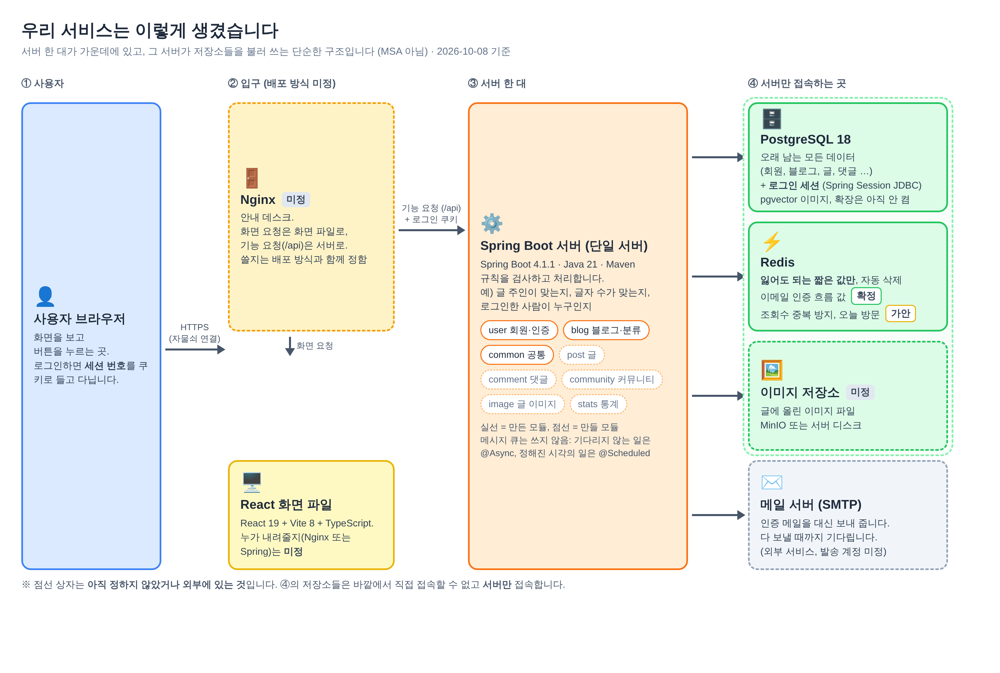

- 서버: **Spring Boot 4.1.1, Java 21, Maven**. 화면: **React 19 + Vite 8 + TypeScript**. DB: **PostgreSQL 18**(pgvector가 들어 있는 이미지, 확장은 아직 켜지 않음). 버전은 가안입니다(2026-10-08 결정).
- 안쪽 4개(PostgreSQL, Redis, 이미지 저장소, 메일)는 **서버만 접속**하고 바깥에서 직접 접속하지 못하게 합니다.
- 로그인 상태는 **서버 세션**으로 기억하고, 세션은 **PostgreSQL**에 둡니다(Spring Session JDBC, 확정). JWT는 쓰지 않습니다.
- Redis에는 **잃어도 되는 짧은 값만** 둡니다. 이메일 인증 흐름 값은 확정, 조회수 중복 방지와 오늘 방문 표시는 가안입니다.
- 메시지 큐(RabbitMQ 등)는 쓰지 않습니다(확정). 기다리지 않아도 되는 일은 `@Async`, 정해진 시각에 하는 일은 `@Scheduled`로 합니다. 인증 메일은 실패를 바로 알려야 해서 **다 보낼 때까지 기다립니다**.
- Nginx와 "화면 파일을 누가 내려주나"는 배포 방식과 함께 정합니다(미정). 개발 중에는 Nginx를 쓰지 않습니다.

## 2. 데이터 지도: 무엇이 어디에 저장되나

| 저장소 | 저장되는 것 | 얼마나 오래 |
|---|---|---|
| **PostgreSQL** | 회원(BCrypt로 해시한 비밀번호, 로그인 실패 횟수와 잠금 시각은 내 확장 E-1), 블로그, 분류, 글(마크다운 원문, 주제), 댓글, 이미지 기록, 일별 통계(내 확장 표 `post_daily_stat`, E-5), **로그인 세션**(Spring Session JDBC) | 영구. 세션은 **마지막 사용 후 7일**, 로그인한 때부터 **최대 30일** |
| **Redis** | 이메일 인증 흐름 값: 인증번호와 인증 증표(원문 대신 서버 비밀키로 바꾼 값), 틀린 횟수, "인증됨" 표시, 1분·하루 발송 제한 (확정). 조회수 중복 방지, 오늘 방문 표시 (가안) | 10분~하루, **자동 삭제**. 잃어도 다시 하면 되는 값만 |
| **이미지 저장소** (미정: MinIO 또는 서버 디스크) | 이미지 파일 본체 | 글을 지우면 같이 삭제, 글에 연결되지 않은 것은 정리 작업이 삭제 |
| **브라우저 쿠키** | 로그인 세션 번호 `SESSION`(스크립트가 못 읽게 `HttpOnly`, `SameSite=Lax`, 배포에서는 `Secure`), CSRF 토큰 `XSRF-TOKEN`(화면이 읽어서 `X-XSRF-TOKEN` 헤더로 보냄) | 로그아웃하거나 만료될 때까지 |
| **메일 서버** | 인증 메일 (저장하지 않고 보내기만 함, 발송 계정 미정) | — |

- **탈퇴하면** 회원 줄은 남기고 이메일, 비밀번호, 닉네임, 소개를 **알아볼 수 없게 바꿉니다**(익명화, `specs/002` D-2). 남는 댓글은 "탈퇴한 사용자"로 보입니다. 블로그와 분류(그리고 글, 통계 등)는 지웁니다(3-3).

## 3. 서버 안의 구조

### 3-1. 요청이 처리되는 순서

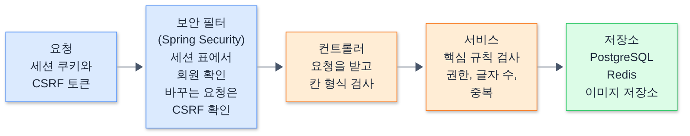

그림 원본 보기 (그림을 고칠 때만 필요)

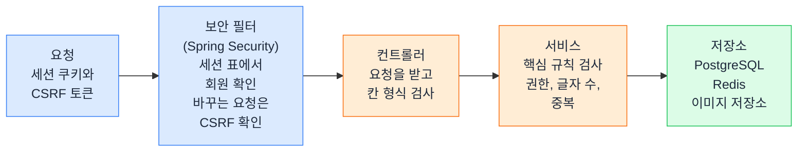

핵심 규칙(누가 고칠 수 있나, 글자 수 제한 등)은 **서비스**에서 검사합니다. 화면의 검사는 보조입니다. 보안 필터는 **로그인이 필요한 것이 기본**이고, 로그인 없이 여는 주소만 하나씩 적어 둡니다.

### 3-2. 기능별 모듈과 부르는 방향

서버는 기능별로 폴더(모듈)를 나눕니다. **화살표 방향(아래쪽)으로만 부를 수 있고, 반대 방향이나 서로 부르는 순환은 하지 않습니다.** 방향은 `user ← blog ← post ← comment / community / image`이고, `stats`(통계)는 다른 모듈의 데이터를 **읽기만** 합니다. `common`(오류 응답, 시각 등)은 모든 모듈이 씁니다.

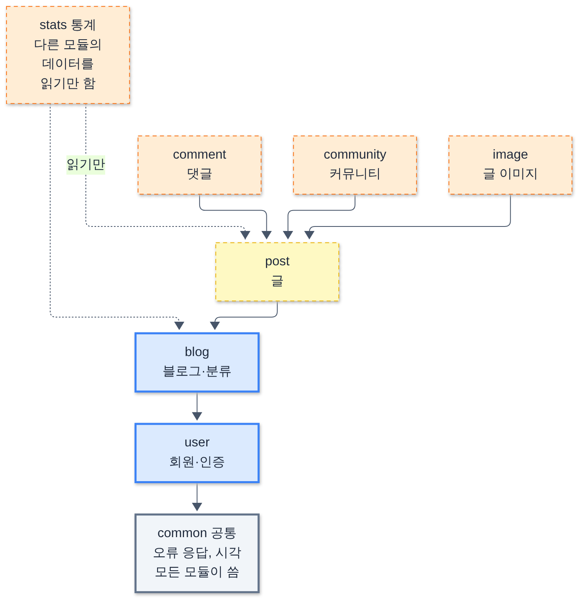

그림 원본 보기 (그림을 고칠 때만 필요)

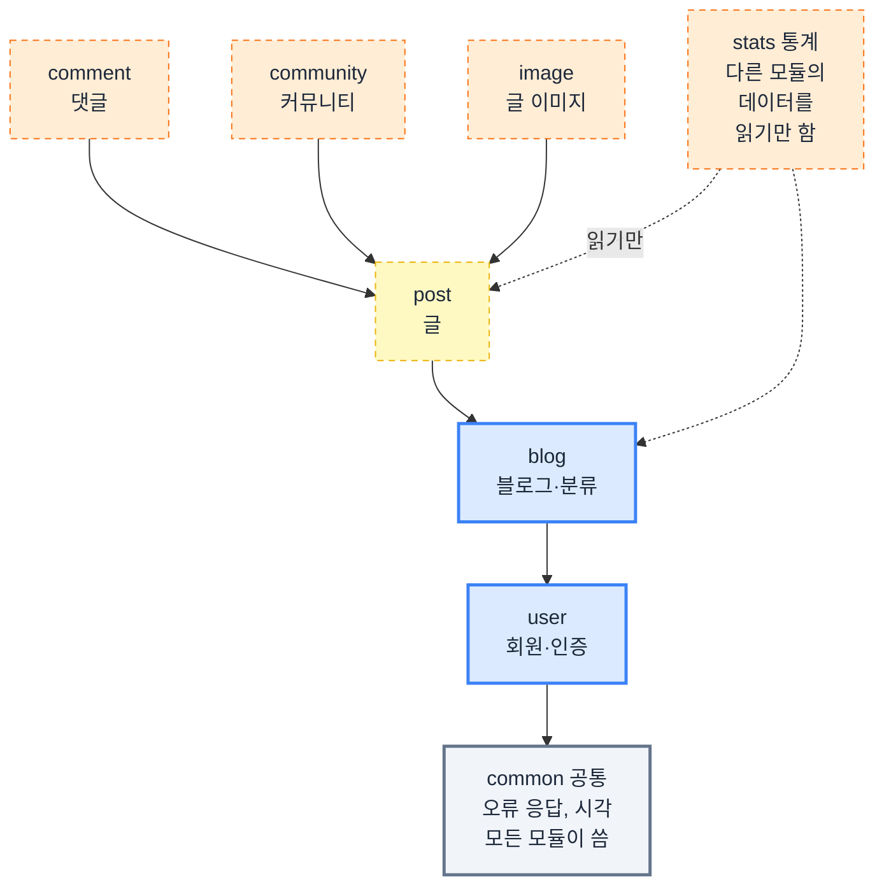

- 실선 상자(`user`, `blog`, `common`)는 이미 만든 모듈, 점선 상자는 앞으로 만들 모듈입니다. 모듈 이름과 나누는 방법은 가안입니다(단일 서버는 확정).
- 이 규칙은 **Spring Modulith 테스트**가 지킵니다. 다른 모듈의 안쪽을 직접 부르거나 고리가 생기면 테스트가 실패합니다.
- 예를 들어 댓글은 글을 알아야 하지만, 글은 댓글을 몰라도 됩니다. 이렇게 하면 한 부분을 고쳐도 다른 부분이 덜 흔들립니다.
- 아래 모듈이 위 모듈에 알려야 할 때는 직접 부르지 않고 **이벤트**로 알립니다(3-3). 아래 모듈이 위 모듈의 답이 필요하면 아래 모듈이 "질문 틀"만 정하고 위 모듈이 채웁니다(예: `user`의 `MemberBlogLookup`을 `blog`가 채움, 마이페이지의 "내 블로그 번호").

### 3-3. 모듈끼리 소식 전하기 (이벤트)

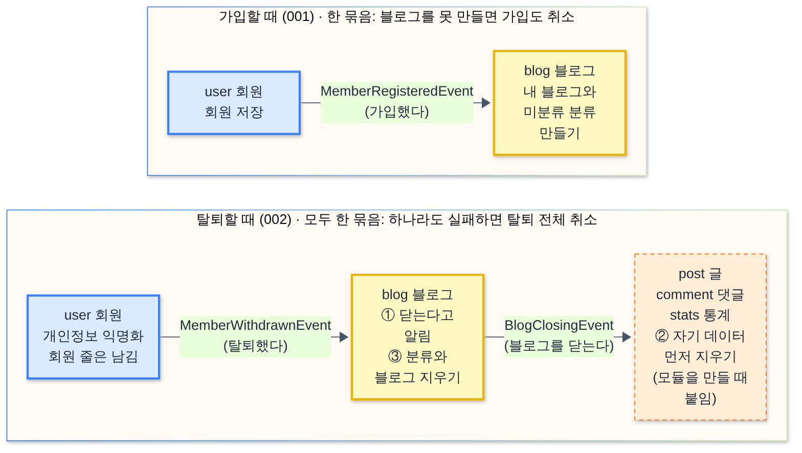

그림 원본 보기 (그림을 고칠 때만 필요)

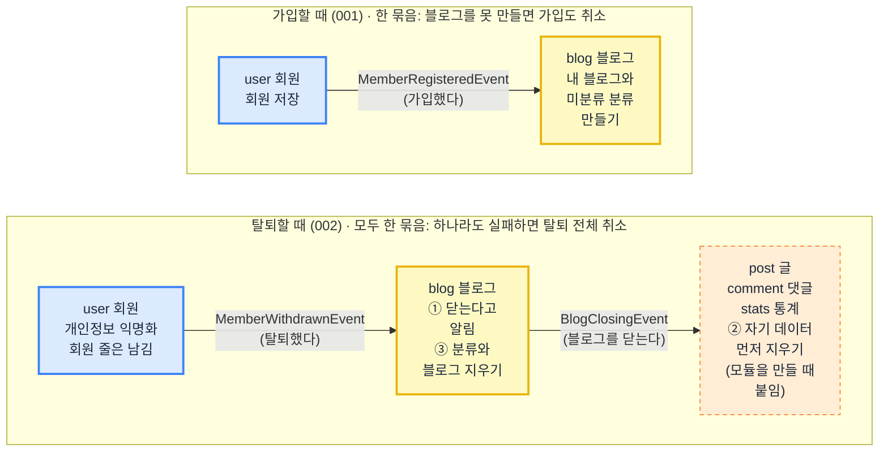

- **가입**: `user`가 회원을 저장하고 `MemberRegisteredEvent`(가입했다)를 냅니다. `blog`가 듣고 그 회원의 블로그와 "미분류" 분류를 만듭니다. 같은 묶음(트랜잭션)이라 블로그를 못 만들면 가입도 취소됩니다. (001, 만듦)
- **탈퇴**: `user`가 개인정보를 익명화하고 `MemberWithdrawnEvent`(탈퇴했다)를 냅니다. `blog`가 듣고 먼저 `BlogClosingEvent`(블로그를 닫는다)를 내서 글, 댓글, 통계 모듈이 **자기 데이터를 스스로 먼저 지우게** 한 뒤, 분류와 블로그를 지웁니다. 모두 같은 묶음이라 하나라도 실패하면 탈퇴 전체가 취소됩니다. (002, 만듦. 글·댓글·통계 쪽은 그 모듈을 만들 때 붙입니다)
- 이미지 **파일**은 묶음이 끝난 뒤 지웁니다(`specs/002` R-7).

## 4. 핵심 흐름 3가지

### 4-1. 회원가입과 이메일 인증 (가입하기 **전에** 인증)

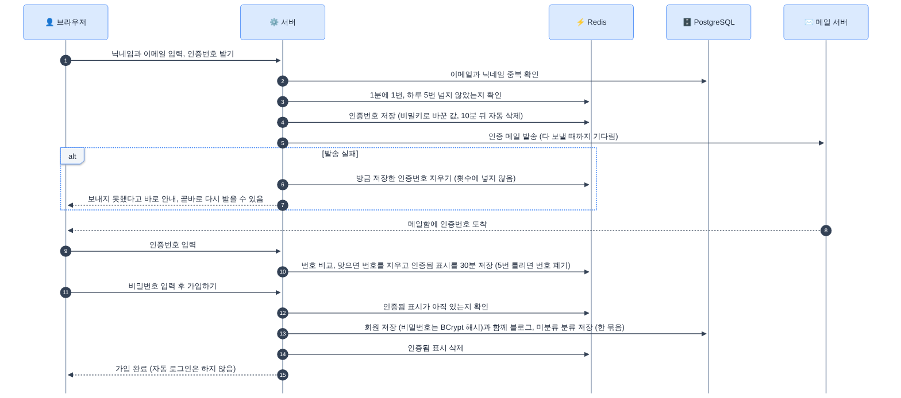

그림 원본 보기 (그림을 고칠 때만 필요)

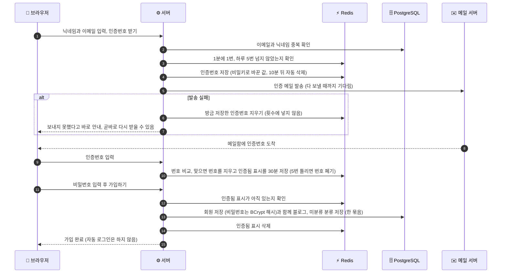

- 인증 메일은 **다 보낼 때까지 기다렸다가** 결과를 알려 줍니다. 실패하면 방금 만든 인증번호를 지우고 횟수에도 넣지 않아서, 곧바로 다시 받을 수 있습니다(`specs/001` D-2). 개발 중에는 메일을 보내지 않고 서버 로그에 인증번호를 찍습니다.
- 인증번호와 "인증번호를 받은 사람" 표시(인증 증표)는 원문 대신 **서버 비밀키로 바꾼 값**으로 Redis에 둡니다. 비밀키는 환경 변수로만 넣습니다.
- 13번의 블로그와 미분류 분류는 3-3의 가입 이벤트로 만듭니다.

### 4-2. 로그인과 세션

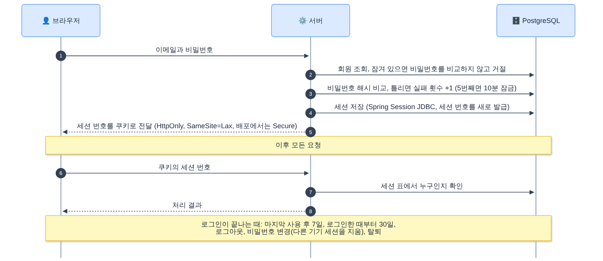

그림 원본 보기 (그림을 고칠 때만 필요)

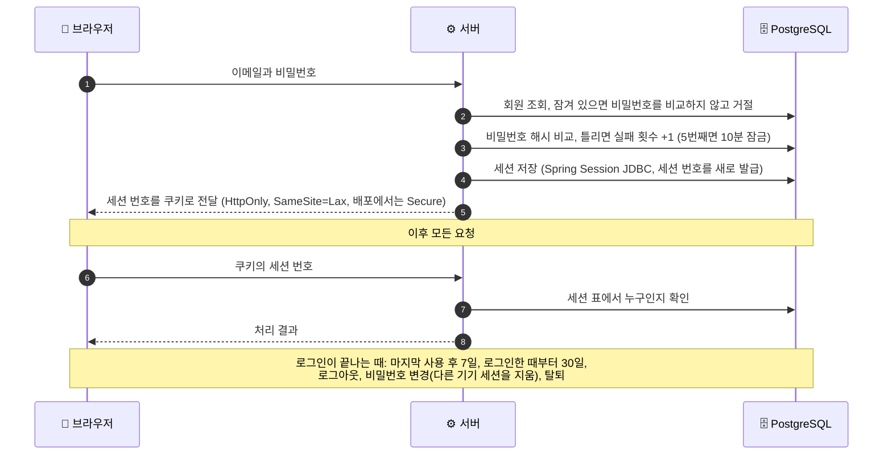

- 로그인 확인은 **Spring Security**가 합니다. 5번 연속 틀리면 10분 잠급니다. 실패 횟수와 잠금 시각은 회원 표의 칸(내 확장 E-1)에 둡니다.
- 로그인은 **마지막 사용 후 7일**이 지나거나, 계속 쓰더라도 **로그인한 때부터 30일**이 지나면 끝납니다.
- 비밀번호를 바꾸면 **지금 기기만 남기고 다른 기기의 세션을 지웁니다**(002).

### 4-3. 글 작성과 이미지 업로드 (가안)

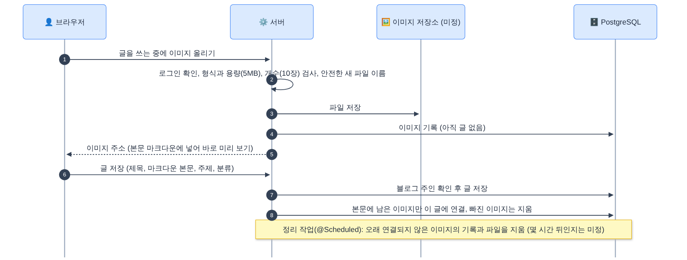

그림 원본 보기 (그림을 고칠 때만 필요)

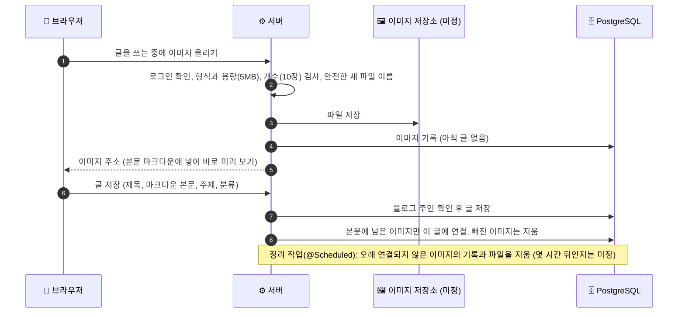

- 이미지는 **글을 저장하기 전에 먼저 올리고**, 글을 저장할 때 본문에 남은 이미지만 그 글에 연결합니다. 오래 연결되지 않은 이미지는 정리 작업(`@Scheduled`)이 지웁니다(`specs/005` D-3 결정). 몇 시간 뒤에 지울지는 미정입니다.
- 글을 쓸 때 서비스 전체의 **주제**(여행, 음식, 취미, 운동, 개발)를 고르고, 내 블로그 안의 **분류**도 고릅니다.
- 이미지 저장소는 아직 **미정**(MinIO 또는 서버 디스크)입니다.

조회수와 방문자 집계, 실시간 인기 검색어 흐름은 [기술스택-아키텍처.md](기술스택-아키텍처.md) 3장 F, G에 있습니다.

## 5. 개발, 검사, 배포 환경

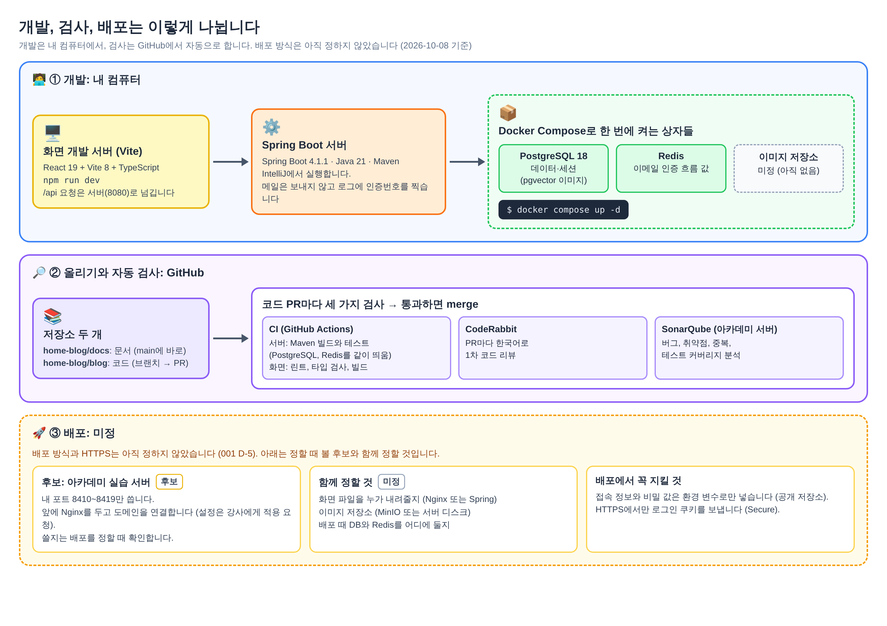

- **개발**: 내 컴퓨터에서 화면(Vite)과 서버(Spring Boot)를 켜고, PostgreSQL과 Redis는 Docker Compose로 띄웁니다. 이미지 저장소는 아직 Compose에 없습니다(미정).
- **저장소 두 개**: 문서는 `home-blog/docs`(이 저장소, `main`에 바로), 코드는 `home-blog/blog`(브랜치를 만들어 PR로).
- **자동 검사**: 코드 PR마다 CI(GitHub Actions: 서버 Maven 빌드·테스트, 화면 린트·빌드), CodeRabbit(한국어 1차 리뷰), SonarQube(아카데미 서버, 품질 분석)가 돕니다.
- **배포**: **미정**입니다. 후보로 아카데미 실습 서버(내 포트 8410~8419만 쓰고, 앞의 Nginx로 도메인을 연결)가 있지만, 쓸지는 배포를 정할 때 확인합니다. 서버 주소와 계정 정보는 이 공개 저장소에 적지 않습니다.
- 개발 방법은 [03-로컬환경-도커컴포즈-사용법.md](../4-가이드/03-로컬환경-도커컴포즈-사용법.md), 배포는 [05-배포-준비.md](../4-가이드/05-배포-준비.md)에 있습니다.

## 6. 그림으로 정리하며 정한 것 (가안)

| 확인할 것 | 정한 값 (추천) | 상태 |
|---|---|---|
| 글 주인 본인의 조회를 조회수에 넣는지 | **세지 않음** (통계 왜곡 방지) | 가안 (`상세/06`은 "확인 필요") |
| 이미지 주소를 어떻게 보여 주는지 | **서버를 거쳐** `/images/...`로 보여 줌. 저장소 포트를 비공개로 둘 수 있음 | 가안 |
| 화면 파일을 누가 내려주는지 | Nginx 또는 Spring. **배포 환경을 정할 때 결정** | 미정 |
| 인기 검색어 순위 저장 위치 | **서버 메모리**로 시작 (서버 한 대라 충분) | 가안 |

## 7. 나중에 붙일 수 있는 것: AI

PostgreSQL을 고른 이유 중 하나는 나중에 AI 기능(비슷한 글 추천, 의미 기반 검색)을 붙일 때 **`pgvector`**(PostgreSQL 확장)로 같은 DB 안에서 처리할 수 있어서입니다. 개발용 DB와 CI는 이미 pgvector가 들어 있는 이미지(`pgvector/pgvector:pg18`)를 쓰지만, **확장은 아직 켜지 않았습니다**. 기능을 만들 때 Flyway로 켜고 벡터를 담는 표를 **새로 추가**합니다. 임베딩 기능은 추후 확장 후보이고, 글을 벡터로 바꾸는 AI 모델을 어디서 가져올지는 **미정**입니다. ([기술스택-아키텍처.md](기술스택-아키텍처.md) 2.3 참고)

## 8. 그림을 고치려면

| 그림 | 원본 | 다시 만드는 방법 |
|---|---|---|
| 01 전체 구성도, 07 개발·검사·배포 환경 | `그림/원본/전체구성도.html`, `그림/원본/개발과배포환경.html` | 파일을 고친 뒤 크롬으로 캡처 |
| 02~06, 08 순서도 | 이 문서의 "그림 원본 보기" 안의 Mermaid 코드, `그림/원본/*.mmd` | Mermaid로 그림 파일 생성 |

방법은 [그림/원본/README.md](그림/원본/README.md)에 있습니다. 직접 하기 어려우면 Claude에게 "그림을 이렇게 고쳐서 다시 만들어 줘"라고 요청하면 됩니다.
